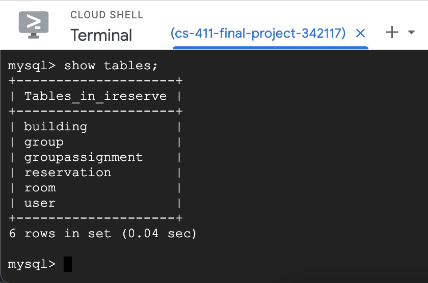
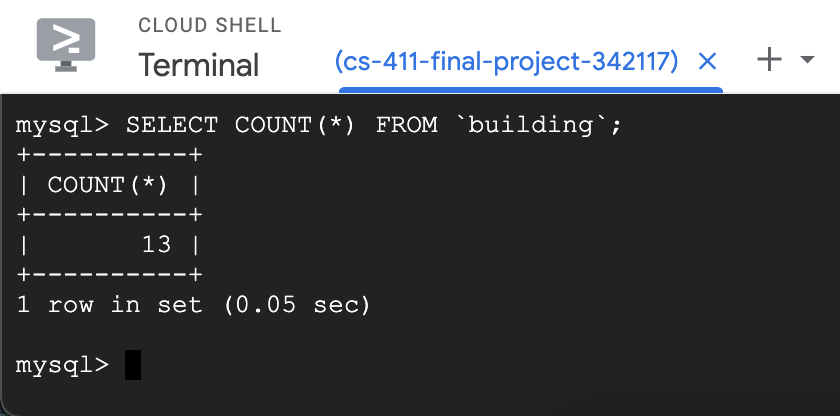
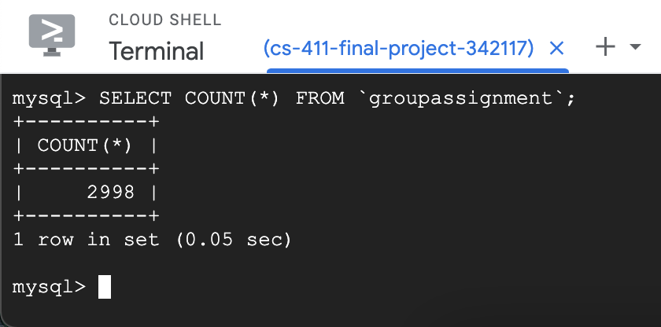
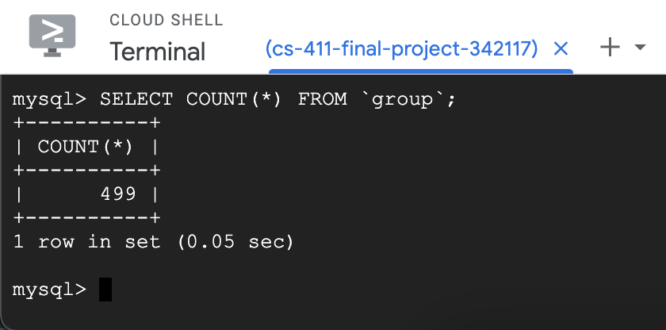
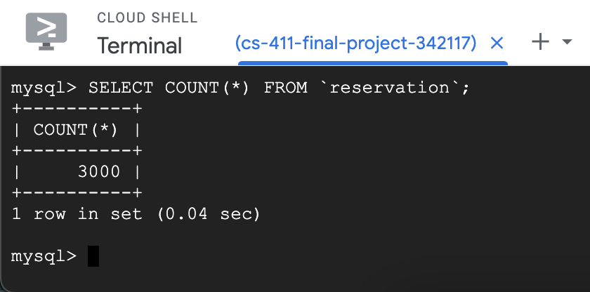
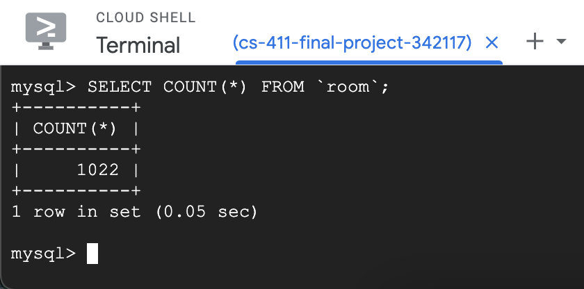
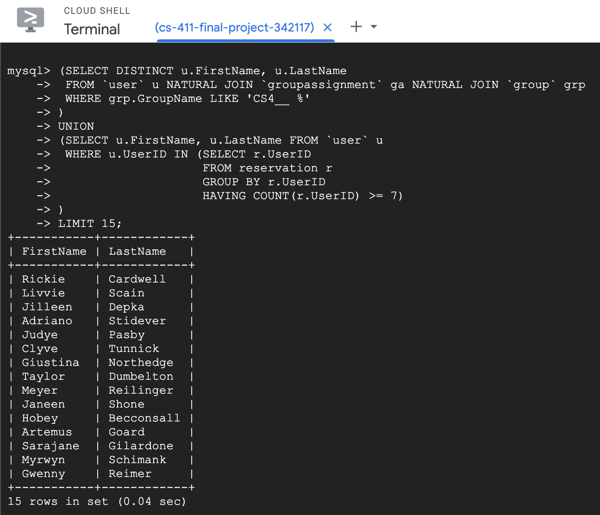
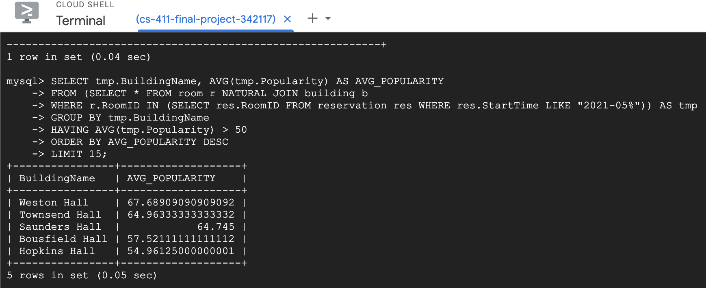

# Database Design

## Data Definition Language Commands

```sql
CREATE DATABASE `ireserve`;

USE `ireserve`;

DROP TABLE IF EXISTS `user`;

CREATE TABLE `user` (
  `UserID` INT PRIMARY KEY, 
  `FirstName` VARCHAR(255) NOT NULL,
  `LastName` VARCHAR(255) NOT NULL, 
  `Email` VARCHAR(255) NOT NULL, 
  `HashedPassword` VARCHAR(255) NOT NULL
);

DROP TABLE IF EXISTS `building`;

CREATE TABLE `building` (
  `BuildingID` INT PRIMARY KEY,
  `Address` VARCHAR(255) NOT NULL,
  `BuildingName` VARCHAR(255) NOT NULL,
  `Region` VARCHAR(255) NOT NULL
);

DROP TABLE IF EXISTS `room`;

CREATE TABLE `room` (
  `RoomID` INT PRIMARY KEY,
  `BuildingID` INT,
  `FloorNumber` INT,
  `RoomNumber` INT,
  `RoomCapacity` INT,
  `RoomType` VARCHAR(50) NOT NULL,
  `Popularity` REAL,
  FOREIGN KEY (`BuildingID`) REFERENCES `building` (`BuildingID`) ON DELETE CASCADE
);

DROP TABLE IF EXISTS `groupassignment`;

CREATE TABLE `groupassignment`(
  `AssignmentID` INT PRIMARY KEY,
  `UserID` INT,
  `GroupName` VARCHAR(100) NOT NULL,
  FOREIGN KEY (`UserID`) REFERENCES `user` (`UserID`) ON DELETE CASCADE
);

DROP TABLE IF EXISTS `reservation`;

CREATE TABLE `reservation` (
  `ReservationID` INT PRIMARY KEY,
  `RoomID` INT,
  `UserID` INT,
  `AssignmentID` INT,
  `StartTime` VARCHAR(100) NOT NULL,
  `EndTime` VARCHAR(100) NOT NULL,
  FOREIGN KEY (`RoomID`) REFERENCES `room` (`RoomID`) ON DELETE CASCADE,
  FOREIGN KEY (`UserID`) REFERENCES `user` (`UserID`) ON DELETE CASCADE,
  FOREIGN KEY (`AssignmentID`) REFERENCES `groupassignment` (`AssignmentID`) ON DELETE CASCADE
);
```

## Database Implementation



## Data Insertion








## Advanced Query 1

Find all priority users. We define priority users as those who are in a group for a 400 level CS course or have made 7 or more reservations with our application.

```sql
(SELECT DISTINCT u.FirstName, u.LastName
 FROM `user` u NATURAL JOIN `groupassignment` ga NATURAL JOIN `group` grp
 WHERE grp.GroupName LIKE 'CS4__ %'
)
UNION
(SELECT u.FirstName, u.LastName FROM `user` u
 WHERE u.UserID IN (SELECT r.UserID 
                    FROM reservation r 
                    GROUP BY r.UserID 
                    HAVING COUNT(r.UserID) >= 7)
)
```

Results:


## Advanced Query 2

Find all all buildings with reservations made in them in May 2021 and with an average room populatity larger than 50.

```sql 
SELECT tmp.BuildingName, AVG(tmp.Popularity) AS AVG_POPULARITY
FROM (SELECT * FROM room r NATURAL JOIN building b
WHERE r.RoomID IN (SELECT res.RoomID FROM reservation res WHERE res.StartTime LIKE "2021-05%")) AS tmp
GROUP BY tmp.BuildingName
HAVING AVG(tmp.Popularity) > 50
ORDER BY AVG_POPULARITY DESC;
```

Results:


## Advanced Query 1 Indices

### Before Photo:


### Index 1
We created an index on the first ten characters of the group name field in the group table. This caused the cost of filtering by group name to decrease from 50.99 to 5.66 because it had to scan fewer rows and the nested inner join also became faster because it had fewer rows to scan and the cost had decreased. 


### Index 2
We created an index on the first character of the group name field in the group table. This caused the cost of filtering by group name to only scan 66 rows instead of 499 and decrease the cost from 50.99 to 29.96. This index is not as efficient because it starts with the first character and there are multiple courses that start with “C” other than CS for our query.


### Index 3 
We created an index on the first 3 characters of the group name field in the group table. This caused the cost of filtering by group name to decrease from 50.99 to 5.66 because it had to scan fewer rows and the nested inner join also became faster because it had fewer rows to scan and the cost had decreased. This index had the same outcome as the first index we created with an index on the first ten characters of the group name field in the group table because the filter was only looking for the first 3 characters of the group name thus an index with more then 3 characters will be the same.


## Advanced Query 2 Indices

### Before Photo:


### Index 1
We created an index on the first 4 characters of the Start time in the reservation table. This caused the cost of filtering by start time to not change from 304.25 because the index we were searching for is equally as efficient. Since there were so many rows that started with a year of 2021, using the primary key to search for rows was not faster than using the index in the reservation table for the start time filters. 


### Index 2
We created an index on the start time field on the first 7 characters to make searching for the month and year faster. When we filter by just this constraint in the index, the cost goes from 304.25 to 83.51. This is because the number of rows to filter goes from 3000 to 185. The query itself only knows to look for a certain year and month, and just like a B+ tree, can narrow down where to look therefore decreasing the cost.


### Index 3 
We created an index on the Room ID field that searches for rooms that have null values. We saw that there was no change from 304.25 because we ended up finding that there were no rooms that were not null. Therefore, we ended up filtering by the primary key again, and not by the index. 


